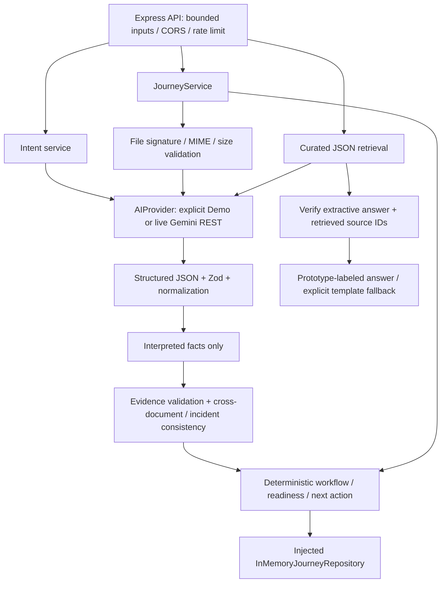

# NAVI — actual architecture (Developer B Phase 2)

**AI interprets. The system decides.** NAVI is a service navigation layer, not an insurer's eligibility or claim submission system. The mock insurance website is a separate application.

## Implemented backend



`apps/api/src/services/gemini.service.js` implements the provider interface with native fetch, not a Google SDK imported into controllers. `ai/prompts/` holds separate system instructions. `ai/schemas.js` validates model-only outputs; `shared/intelligence.js` and `shared/journey.js` define public contracts. The model cannot supply scores, workflow stages or actions. Missing facts remain null.

The default model is `gemini-3.5-flash-lite`, configured centrally. A single 10-second deadline covers at most two attempts. Live intent/document failures return safe API errors and leave the stored Journey unchanged. Only non-critical knowledge/handoff wording can use the actual retrieved/known-fact template, explicitly labeled.

Workflow scoring is unchanged: incident 20 + service 15 + complete travel information 15 + boarding evidence 20 + delay certificate 20 + confirmation 10. Complete Golden Path remains **35 → 70 → 90 → 100**. Evidence conflict or low document confidence triggers human review; partial travel information cannot produce a ready-for-review journey. None of these states is an eligibility decision.

Only extracted fields and bounded server Journey records are stored in memory; file bytes are request-scoped. Repository TTL/capacity and rate limits remain process-local. There is no database, authentication, durable storage, insurer submission or specialist connection.

## Current frontend integration boundary

```text
React Landing → /api/intelligence/understand → real Gemini intent → validated NAVI envelope
                                                             → existing browser workflow
                                                             → Mock document UI / sources
```

Developer B did not modify `apps/web`. The server-owned Journey, real document pipeline, grounded answer and enhanced handoff are callable via HTTP/CLI; the workspace has not yet adopted them. Developer A must add the existing Mock/Live adapter without changing UI or motion. Browser persistence remains the existing sessionStorage implementation. API tests are not evidence that the UI is reading real documents.

## Repository layout / independent sites

- `apps/web`: React/Vite NAVI, `127.0.0.1:5173`; dev `/api` proxy to 3001.
- `apps/api`: Express NAVI API, `127.0.0.1:3001`; Gemini Key only in ignored local `.env`.
- `apps/mock-site`: independent Next.js mock insurance website, `127.0.0.1:3000`; owns routing/assets/styles and imports original `data/` and `lib/contracts/`.
- `shared/`: NAVI Zod public contracts; original mock-site contracts are preserved separately.
- `knowledge/`: labeled prototype FAQs, sources, Journey requirements and score rules; no official coverage claims.

`npm run dev:all` starts three separate processes. There is no embedded assistant or automatic cross-site transport. Current demo switches tabs manually. Original `SPEC.md` describes broader planned work, not the implementation status.

## Delivered / deferred

| Capability | Status |
| --- | --- |
| Real structured Intent Understanding | Implemented; Chinese/English/secondary/unknown live tests passed |
| Server-owned Journey / workflow / scoring / next action | Implemented; deterministic |
| Real PDF/PNG/JPEG/WebP document transport + extraction | Implemented; synthetic PDF Live Golden Path passed |
| Evidence validation / consistency | Implemented; conflicts flagged for human review |
| JSON-grounded AI with verified prototype source IDs | Implemented; conservatively extractive |
| AI handoff / safe metadata | Implemented; optional known-fact selection and template fallback |
| Frontend real document / server Journey adapter | Not integrated in this Developer B phase |
| RAG / Vector DB / MongoDB / Auth / Multi-Agent | Not implemented |

See [Backend AI Phase 2](backend-ai-phase-2.md) for schemas, endpoints, tests, operational setup and limitations. Historic Phase 2A and Backend Demo Phase 1 reports remain records of those earlier phases.
