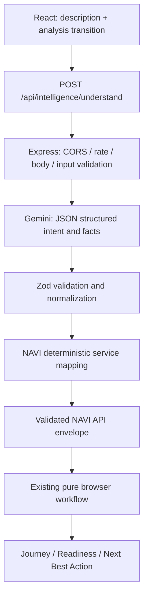

# NAVI — Phase 2A actual architecture

NAVI is a service navigation layer between users and existing enterprise services. **AI interprets. The system decides.** Phase 2A implements server-side natural-language intent understanding. It does not implement document understanding or knowledge retrieval.



## Implemented boundaries

| Capability | Current implementation |
| --- | --- |
| Phase 2A NAVI Intelligence | Express + Gemini REST, strict JSON output, validated API contract, deterministic intent routing |
| NAVI Journey / Action | Existing React workflow, scoring and next-action functions |
| Phase 2B NAVI Vision | **Not implemented**; fixed boarding-pass and delay-certificate fixtures |
| Phase 2C NAVI Knowledge | **Not implemented**; local mock FAQ and labeled sources, no retrieval/RAG |
| NAVI Handoff | Local service summary / text export; no connection to a specialist |
| Existing application | Preview dialog only; no insurer submission |

No database, authentication, multi-agent system or vector service exists. Browser case facts remain prototype state, not trusted server-side claim authority.

## Backend layout

`apps/api/src/app.js` composes middleware and two small endpoints; a separate controller/router pair would only forward the same call. `services/intent.service.js` owns normalization, one invalid-output retry, the overall deadline and deterministic routing. `services/gemini.service.js` owns native fetch and provider transport. `schemas/intent.schema.js` owns request/provider validation, `config/env.js` owns configuration, and `middleware/errorHandler.js` owns safe error envelopes. `server.js` only starts/stops the server.

`shared/intelligence.js` is the single Zod contract shared by API, client and persistence, plus the pure routing function and default 0.65 threshold. It contains no secrets. This keeps enums and validation aligned without an AI abstraction framework or SDK dependency.

## API

- `GET /api/health` → `{ "status": "ok", "aiProviderConfigured": false }`. Configuration is not provider connectivity/readiness.
- `POST /api/intelligence/understand` accepts exactly `{ "message": "..." }`, trimmed, 1–2,000 characters.

```json
{
  "success": true,
  "data": {
    "intent": "service_request",
    "serviceType": "flight_delay",
    "confidence": 0.96,
    "summary": "使用者表示從東京返回台灣的航班延誤約 7 小時。",
    "extractedData": {
      "origin": "Tokyo",
      "destination": "Taiwan",
      "delayMinutes": 420,
      "incidentDate": null
    }
  },
  "meta": {
    "source": "gemini",
    "outcome": "supported",
    "confidenceThreshold": 0.65
  }
}
```

`intent`: `service_request`, `knowledge_query`, `unknown`.

`serviceType`: `flight_delay`, `vehicle_accident`, `payment_method_change`, `policy_change`, `policy_information`, `unknown`.

The Gemini schema has only the five data fields. **`meta` comes from NAVI**, never from the model. It is routing metadata, not a model-assigned stage, score, next action or eligibility determination.

Confidence must be numeric and finite; missing values become zero, out-of-range values clamp to 0–1. Strings/enums/types, required nullable fields and real calendar dates are validated. Additional fields (including readiness/state/actions) fail validation. Invalid output retries once within the same ten-second deadline, then returns `AI_RESPONSE_INVALID`.

Unknown intent/service is normalized to `unknown` with null extracted fields and normal successful `clarification` routing. Known needs below the configured threshold route to `human_review`. Only confident `service_request + flight_delay` routes to the complete journey. Other recognized needs and knowledge queries route to `preview`, clearly stating that the complete journey is unavailable. They never create a fake multi-step workflow.

API errors use `{ "success": false, "error": { "code": "AI_TIMEOUT", "message": "分析時間較長，請重新分析。" } }`. Codes include `INVALID_INPUT` (400), `REQUEST_TOO_LARGE` (413), `ORIGIN_NOT_ALLOWED` (403), `RATE_LIMITED` (429), `AI_NOT_CONFIGURED` (503), `AI_PROVIDER_ERROR` / `AI_RESPONSE_INVALID` (502), `AI_TIMEOUT` (504), `INTERNAL_ERROR` (500).

## Gemini transport and safety

Server-only `GEMINI_API_KEY` is sent in `x-goog-api-key`, never in the URL or client bundle. `GEMINI_MODEL` defaults centrally to `gemini-3.8-flash`; the default model uses low thinking to bound this small classification task. Overridden models omit that model-specific setting. The provider uses `generateContent` with `responseMimeType: application/json` and a JSON Schema generated from the validated contract.

The dedicated system prompt treats the description as untrusted data, restricts service enums, asks for concise Taiwanese Traditional Chinese summaries, and extracts only stated facts. It never infers Taipei from Taiwan or invents a date for “yesterday.” It forbids eligibility/payment promises, invented policy rules and workflow/readiness decisions. Schema validation ensures structure, not the truth of every extracted fact; model confidence is not calibrated probability.

Official references: [Gemini 3.8 Flash](https://ai.google.dev/gemini-api/docs/models/gemini-3.8-flash), [structured output](https://ai.google.dev/gemini-api/docs/structured-output), [generateContent API](https://ai.google.dev/api/generate-content). Model access and real latency must be verified using the deployment account; mocked tests do not establish those properties.

## Frontend and workflow preservation

`services/intelligence.js` sends the request, bounds it to twelve seconds, validates the entire envelope and exposes stable error codes. Start immediately enters the existing analysing state while the API runs. Fast success waits for the existing 1,500ms total presentation; slow success retains loading, then completes the short exit. Reduced motion removes the artificial presentation delay. Reset/navigation abort requests and timers; stale results cannot create a new case.

The adapter maps external `vehicle_accident` / `payment_method_change` to existing domain IDs only where needed for summaries. AI case routing uses validated NAVI outcome, preventing the old legacy 0.7 mock threshold from overriding the new API threshold. Legacy Phase 1 sessions still restore compatibly.

Readiness remains incident 20 + service 15 + travel 15 + boarding pass 20 + certificate 20 + confirmation 10. **35 → 70 → 90 → 100** is unchanged. Evidence is still mock; removal/replacement clears confirmation. Delay uses full ISO timestamps and invalid/negative durations return null. The final state remains `READY_FOR_REVIEW`, never approval or insurer submission.

## Explicit demo backup

`VITE_ENABLE_DEMO_FALLBACK=true` is an explicit build/dev flag, default false. Only provider/network/timeout/invalid-response failures may trigger a local flight-delay keyword backup. Unknown/unsupported requests and input/security/rate failures do not become fake successful AI results. The result is separately tagged `source: demo_fallback`; the workspace shows “示範備援判讀 · 本次未使用 AI 分析” and hides the fixture confidence. Valid unknown or low-confidence AI responses never trigger fallback.

This flag is public configuration, not a secret; a production build leaves it off unless deliberately configured otherwise. The backend has no mock/fallback environment switch.

## Storage, privacy and security

The existing `sessionStorage` behavior is preserved (the project used browser-tab storage, not permanent localStorage). `navi.case` stores validated AI interpretation, routing metadata and mock evidence names; reload never reclassifies the description with keywords. Mock document fields are rebuilt from owned fixtures. Legacy brand key migration remains intact. No document bytes or API key are stored. Reset removes both keys. Conversation history and in-flight operations are not persisted.

Request bodies are limited to 16KB; invalid JSON, empty messages, wrong types and oversized descriptions return safe errors. Exact-origin CORS allows localhost/127.0.0.1:5173; default host is loopback. The intent endpoint allows 30 requests/minute/IP with in-memory limiting. Logs contain error code/status only, no key, raw provider response or user description. Same-origin production can reverse-proxy `/api` to Express; configure allowed frontend origins and deployment host deliberately.

## Deliberate debt

- Real Gemini account access, latency and prompt accuracy remain unverified until a key is supplied. Contract tests use an injected Mock Provider.
- Confidence is a model estimate; threshold routing does not guarantee correct classification. More labeled examples/evaluation are needed before release.
- The workflow and saved cases remain browser-owned and unauthenticated. Production claim authority, authorization and audit controls are outside Phase 2A.
- Fixed document fixtures can conflict with real extracted cities/date/duration. Phase 2B must reconcile facts and allow corrections, rather than silently replacing user information.
- In-memory rate limiting is per process; use a shared store if deployment uses multiple instances. CORS is not authentication.
- Prompts and structure validation do not establish policy eligibility or grounded factual answers. FAQ/sources remain clearly labeled mock content.
- Deployment uses dev Vite proxy now. Production needs a same-origin reverse proxy (or explicit API base URL / approved origin).

## Phase 2B suggestion — not implemented

After confirming Phase 2A and its real-provider QA, add a separate bounded document API and structured extraction schema. Validate signatures/size/type, extract actual fields, compare passenger/flight/date/route with case facts, show editable confirmation, and preserve deterministic readiness. Do not add RAG, MongoDB or agents simply to support two documents.

## Repository integration: independent demo website

`apps/mock-site` runs the collaborator's Next.js 16 / Tailwind mock insurance website on 127.0.0.1:3000. It owns its router, public assets, styles, PostCSS and TypeScript config. Its eight pages retain local seed validation, hash tabs and data-tour-id hooks. It imports root `data` and `lib/contracts` through explicit aliases; those original contracts are retained independently of NAVI's `shared/intelligence.js`.

NAVI's `apps/web` (5173) and `apps/api` (3001) remain unchanged in responsibility. `/api` is only proxied by NAVI Vite. Root `npm run dev:all` starts three separate processes, and each site builds separately. No embedded NAVI assistant, cross-site case transport or external application submission was added. The demonstration switches browser tabs manually. The original SPEC describes a broader planned Next/OpenAI/Turso product; its scaffolding is preserved, not claimed as implemented.
